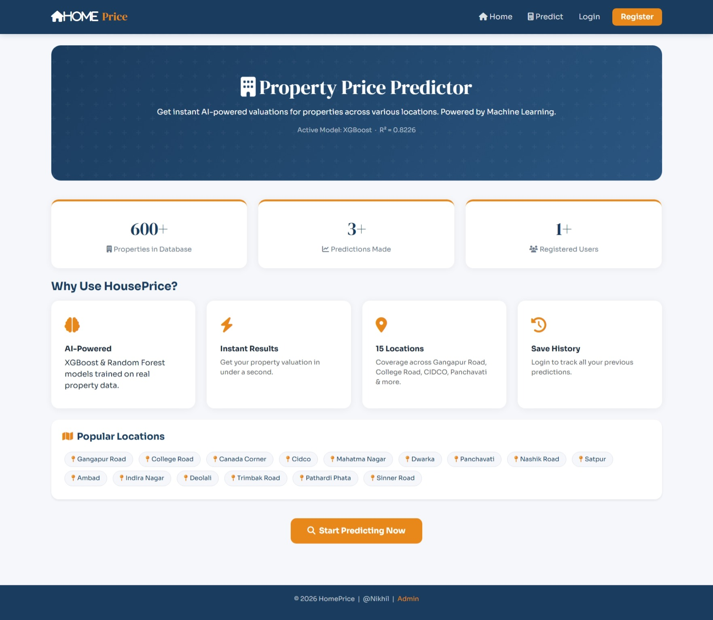
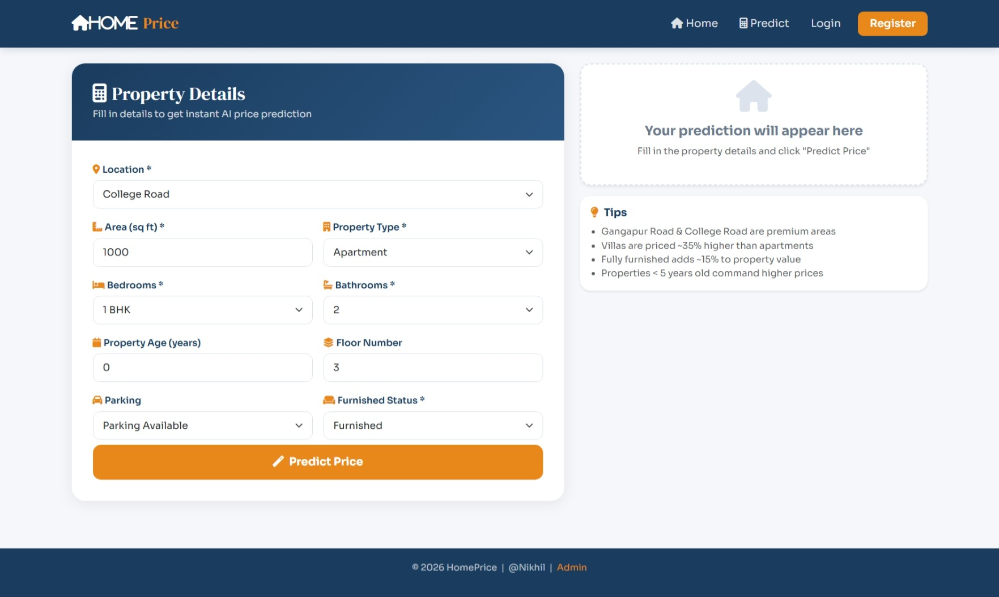
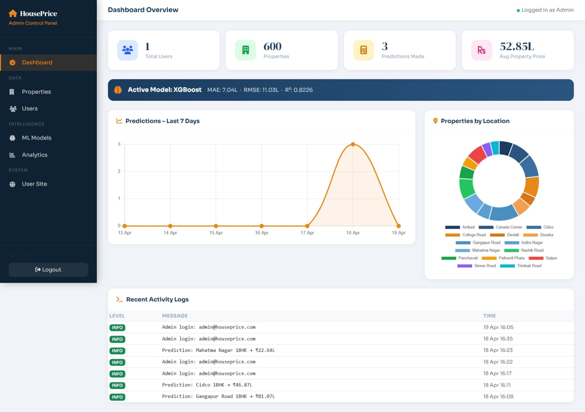

#  HousePrice Prediction System

AI-powered real estate valuation platform.
Includes a full user interface + admin control panel.







---

##  Project Structure

```
houseprice/
├── app.py               ← Main Flask application (all routes)
├── database.py          ← SQLAlchemy DB models
├── ml_service.py        ← ML model loader & prediction engine
├── train_model.py       ← Train all 4 ML models
├── generate_data.py     ← Generate property CSV dataset
├── requirements.txt
├── data/
│   └── houseprice_properties.csv   ← 600 property records
├── models/                      ← Saved .pkl model files
│   ├── linear_regression.pkl
│   ├── random_forest.pkl
│   ├── gradient_boosting.pkl
│   ├── xgboost.pkl
│   ├── encoders.pkl
│   ├── feature_cols.pkl
│   ├── best_model.json
│   └── all_metrics.json
└── templates/
    ├── user/            ← User-facing pages
    └── admin/           ← Admin panel pages
```

---

##  Quick Setup (3 Steps)

### Step 1 – Install dependencies
```bash
pip install -r requirements.txt
```

### Step 2 – Generate data & train models
```bash
python generate_data.py    # Creates data/houseprice_properties.csv
python train_model.py      # Trains 4 ML models, saves to models/
```

### Step 3 – Run the app
```bash
python app.py
```

Then open: **http://localhost:5000**

---

##  Default Credentials

| Role  | Email                | Password   |
|-------|----------------------|------------|
| Admin | admin@houseprice.com | admin123   |
| User  | Register at /register | any        |

Admin Panel: **http://localhost:5000/admin**

---

##  ML Models & Performance

| Model              | MAE (L) | RMSE (L) | R²     |
|--------------------|---------|----------|--------|
| Linear Regression  | 11.36   | 15.97    | 0.6285 |
| Random Forest      | 8.65    | 13.64    | 0.7290 |
| Gradient Boosting  | 6.98    | 11.18    | 0.8178 |
| **XGBoost**        | **7.04**| **11.03**| **0.8226** |

**XGBoost** is auto-selected as the active model (best R²).

---

##  Locations Covered

| Zone    | Locations                                          |
|---------|----------------------------------------------------|
| Premium | Gangapur Road, College Road, Canada Corner         |
| Mid     | Cidco, Mahatma Nagar, Dwarka, Panchavati           |
| Budget  | Nashik Road, Satpur, Ambad, Deolali                |
| Economy | Trimbak Road, Pathardi Phata, Sinner Road, Indira Nagar |

---

##  Features

### User Module
- Predict house prices (no login required)
- View similar properties
- Register/login to save prediction history

### Admin Panel (`/admin`)
- **Dashboard** – KPI cards, daily prediction chart, location distribution
- **Properties** – Add/delete/search/upload CSV/export CSV
- **Users** – Block/unblock/delete users, view prediction count
- **ML Models** – Compare all 4 models, activate any model live
- **Analytics** – Avg price by location, BHK distribution, property type split

---

##  Tech Stack

| Layer       | Technology                              |
|-------------|-----------------------------------------|
| Backend     | Python 3.10+, Flask 2.3                 |
| Database    | SQLite + SQLAlchemy                     |
| ML          | scikit-learn, XGBoost, joblib           |
| Frontend    | Bootstrap 5, Chart.js, Font Awesome     |
| Auth        | Flask sessions + Werkzeug password hash |
